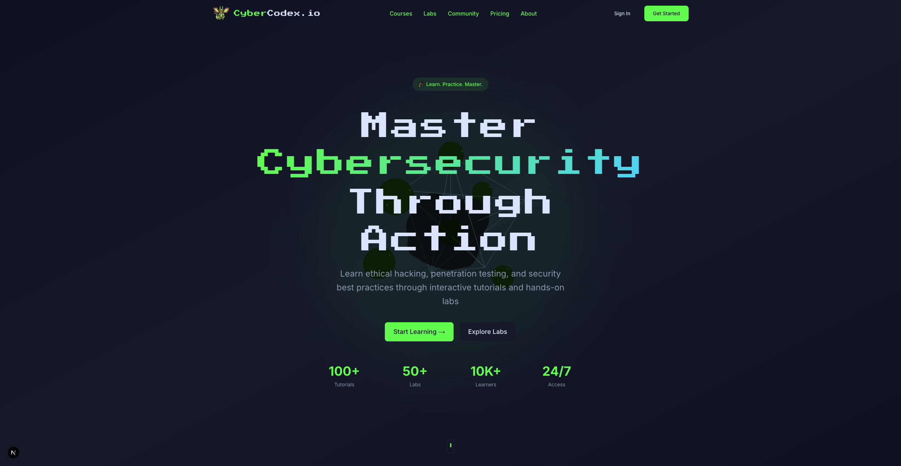
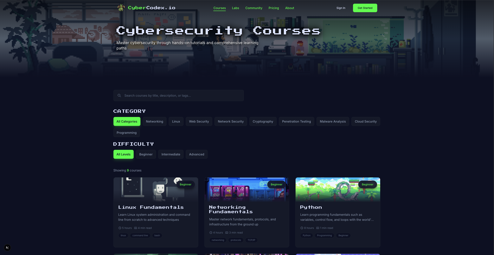
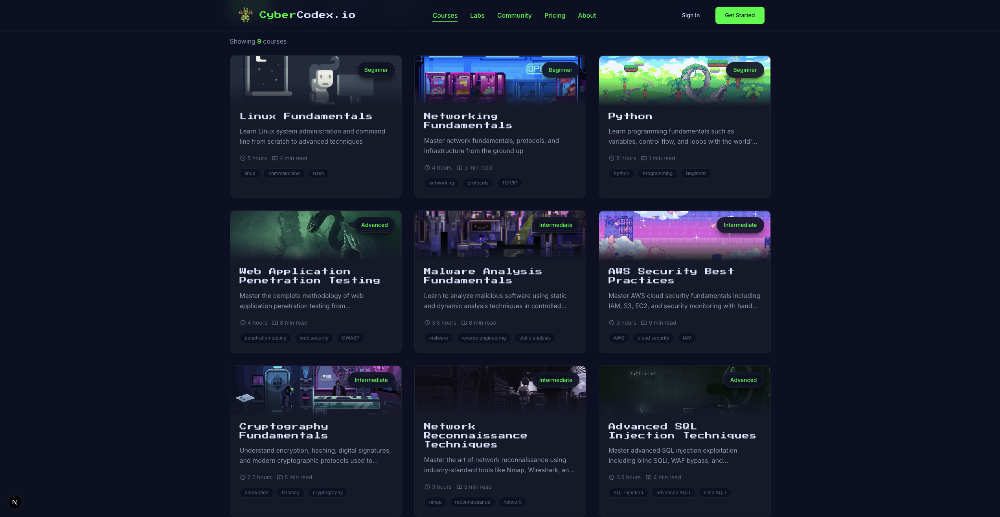
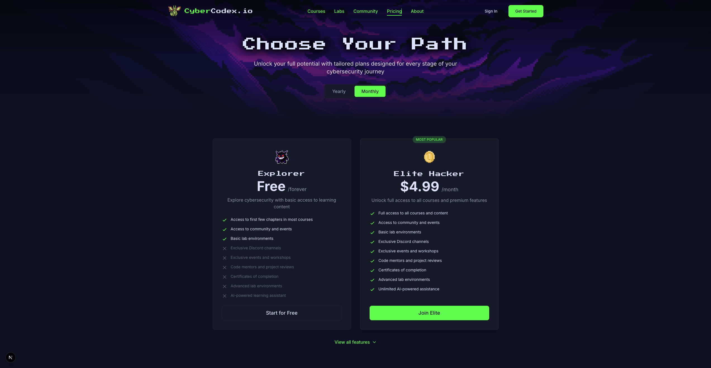
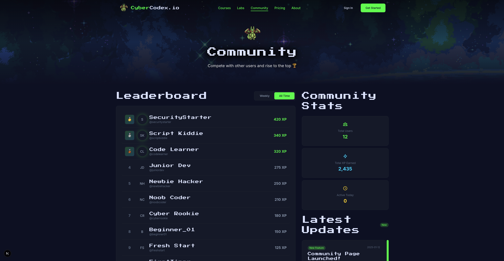
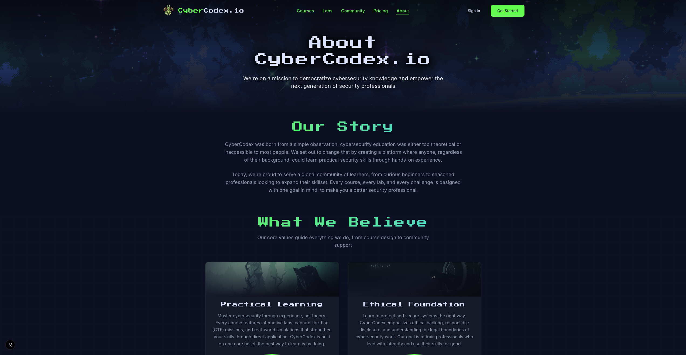

# CyberCodex.io

CyberCodex.io is a modern cybersecurity learning platform built with Next.js. It combines structured course content, interactive learning flows, authentication, and progress tracking into a single web application.

## Highlights

- Structured cybersecurity curriculum with MDX-based lessons
- Authentication with Auth.js (OAuth + credentials)
- Prisma-powered data layer and progress persistence
- Responsive UI with Tailwind CSS v4 and motion-enhanced interactions
- Gamification foundations (XP, levels, streaks, profile progression)

## Tech Stack

- Next.js 16 + React 19 + TypeScript
- Tailwind CSS v4 + Framer Motion
- Auth.js v5
- Prisma ORM + SQLite (local development)

## Screenshots













## Getting Started

### Prerequisites

- Node.js 18+
- npm

### Local Setup

```bash
npm install
cp .env.example .env.local
npx prisma migrate dev --name init
npm run dev
```

Open `http://localhost:3000`.

## Environment Variables

Create `.env.local` from `.env.example`.

Required values:

```bash
DATABASE_URL="file:./dev.db"
AUTH_SECRET="<generate-with-openssl-rand-base64-32>"
AUTH_URL="http://localhost:3000"
```

Optional values enable OAuth, email, rate limiting, and billing integrations.

## Available Scripts

```bash
npm run dev
npm run build
npm run start
npm run lint
npm run type-check
npm run db:seed
npm run db:create-admin
npm run db:clear-sessions
```

## Project Structure

```text
src/
  app/                Next.js routes and API handlers
  components/         Reusable UI and feature components
  lib/                Auth, database, utilities, and validation
  styles/             Global styling and design tokens
content/courses/      Course content and curriculum data
prisma/               Schema and migration history
public/               Static assets
```

## Security Notes

- Keep `.env.local` out of version control.
- Keep local database files untracked (`prisma/*.db`).
- Rotate any key immediately if accidentally exposed.
